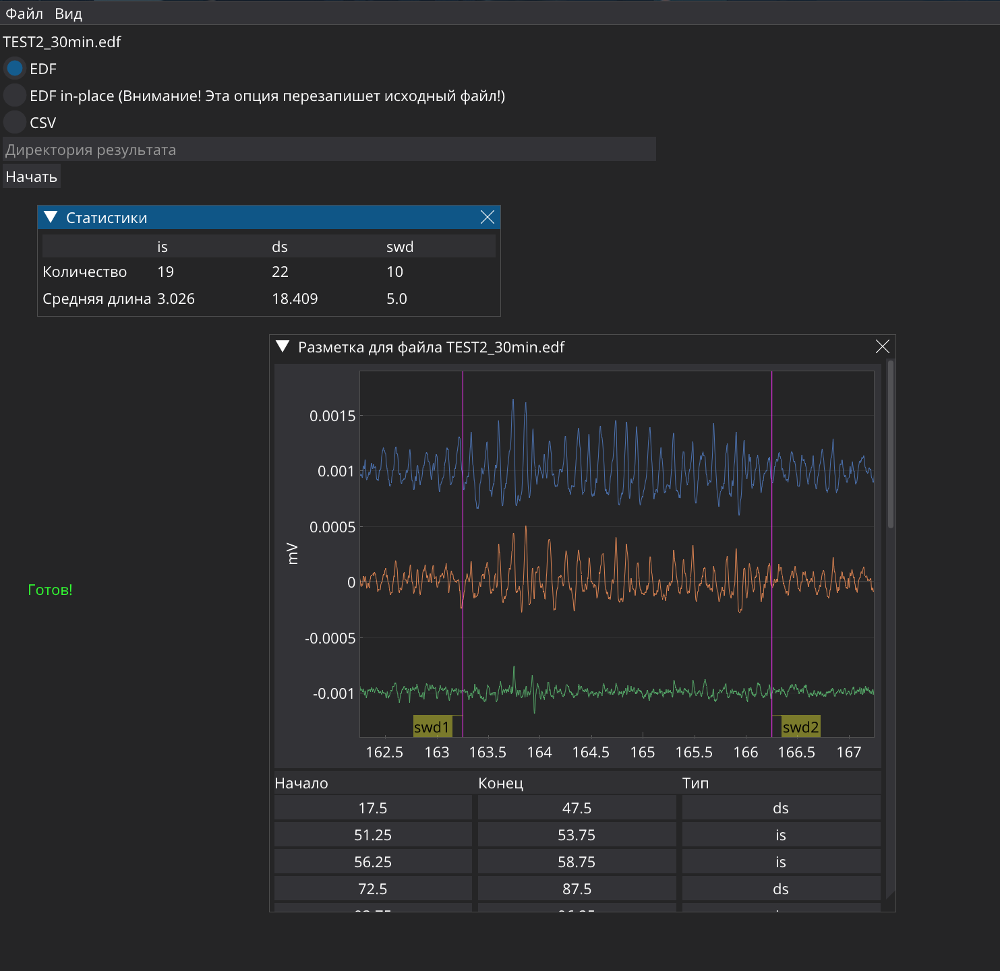

# ElectrocorticogramClassification
Решение команды ThreeNearestNeighbours (MIPT, MISIS)

## Запуск на Windows
Для запуска достаточно распаковать архив, перейти во вложенную папку и запустить RUN.BAT.

Если по каким-то причинам проргамма не запустилась, достаточно сделать следующее:
1. Установить в систему [Python 3.13](https://www.python.org/downloads/release/python-3130/)
2. Скачать этот [репозиторий](https://github.com/Paspasuy/ElectrocorticogramClassification) 
3. Открыть эту папку в командной строке (открыть ее в проводнике нажать правой кнопкой мыши, затем нажать соотв. пункт меню)
4. Ввести команду `python -m pip install -r requirements.txt`
5. Запустить программу: `python main.py`

## Запуск на Linux
Инструкция выше работает и под Linux (Важно: в этом случае советуем заменить зависимость `torch` на `torch-cpu`, т.к. эта библиотека меньше весит. Уберите `torch` из requirements, и установите вручную: `python -m pip install torch --index-url https://download.pytorch.org/whl/cpu`)

# Описание решения

## Общая структура решения

- [main.py](main.py) — основной файл десктопного приложения
- [train_model.py](train_model.py) — скрипт обучения моделей
- [test_model.py](test_model.py) — скрипт инференса моделей и постобработки полученных результатов
- [src](src) — папка с исходным кодом моделей
- [app](app) — папка с кодом десктопного приложения

## [Исследование данных](view_data.ipynb)

## Выбор модели

Пробовали как самостоятельно выбирать фичи, так и обучать модели на сырых данных. Первый подход показал себя значительно лучше.

Пробовали MLP с разным количеством слоев, различные вариации CNN. Остановились на MLP с 2 слоями, так как он показал лучшие результаты и при этом был довольно быстрый

## Эксперименты

- Добавляли позитивы из golden_standart — модель стала лучше обучаться
- Пробовали различные автоэнкодеры — не помогли (смотреть в [experiments.ipynb](experiments.ipynb))
- Пробовали добавлять Wavelet transform как фичи — не помогли
- Зато помогли спектрограммы — модель стала заметно лучше предсказывать сон

## Результаты

Accuracy на валидации:
- 0.99 — SWD
- 0.85 — DS
- 0.79 — IS

Модель размечает 6-часовой файл всего за несколько минут